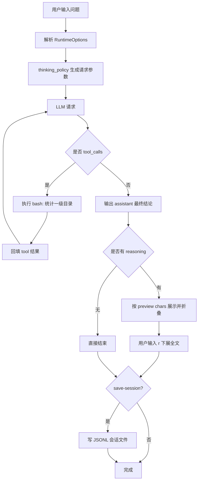

# v1: Bash 就是一切（含通用运行时能力）

v1 仍然保持“单工具 bash”核心，但现在共享了 v1-v5 通用能力：`thinking`、`stream/non-stream`、reasoning 折叠、LLM trace、会话保存。

## 模拟问题
只用 bash 统计项目根目录一级目录数量并给一句结论。

## 决策步骤（编号）
1. 解析 CLI/ENV 运行时配置（`stream`、`thinking`、`save-session` 等）。
2. 根据 thinking 策略决定是否注入 `enable_thinking`/`reasoning_effort` 参数。
3. 发送模型请求（stream 或 non-stream）。
4. 若模型发起 `bash` 工具调用，则执行目录统计命令。
5. 把工具结果回填消息历史并继续下一轮。
6. 模型返回最终结论后结束循环。
7. 若存在 reasoning，按预览字符上限折叠并支持 `r` 下展。
8. 若开启会话保存，写入 `sessions/<model>_<timestamp>.jsonl`。

## Mermaid 全过程流程图


## 运行命令（nano-claude）
```bash
conda run -n nano-claude python v1_bash_agent_demo/bash_agent.py \
  "只用 bash 统计当前项目根目录一级目录数量并给一句结论" \
  --show-llm-response \
  --thinking auto \
  --reasoning-effort low \
  --stream \
  --save-session
```

## 一次真实输出摘录（简短）
```text
$ find . -mindepth 1 -maxdepth 1 -type d | wc -l
17

结论：当前项目根目录下共有 17 个一级目录。
[Session saved] sessions/gpt_4o_mini_20260218_213501.jsonl
```

[← 返回 README](../README.md)
