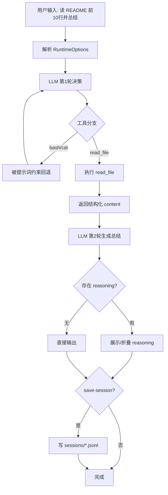

# v2: 结构化文件工具（含通用运行时能力）

v2 在保留 bash 的同时，引入 `read_file/write_file/edit_file`。本次升级后同样支持 thinking 控制、stream/non-stream、reasoning 折叠、会话保存。

## 模拟问题
用 `read_file` 读取 README 前 10 行并总结，不使用 bash `cat`。

## 决策步骤（编号）
1. 解析运行时配置，确定 `stream/thinking/save-session`。
2. LLM 进行工具选择：在 `bash` 与 `read_file` 间决策。
3. 命中约束后调用 `read_file(file_path = "README.md", max_lines = 10)`。
4. 回填结构化读取结果，继续 LLM 总结。
5. 输出最终总结文本。
6. 若含 reasoning，则提示可下展查看全文。
7. 按开关记录 trace 日志与 session JSONL。

## Mermaid 全过程流程图


## 运行命令（nano-claude）
```bash
conda run -n nano-claude python v2_basic_agent_demo/basic_agent.py \
  "请用 read_file 读取 README.md 前 10 行并总结，不要使用 bash cat" \
  --show-llm-response \
  --no-stream \
  --thinking on \
  --reasoning-effort medium
```

## 一次真实输出摘录（简短）
```text
Tool: read_file(file_path="README.md", max_lines=10)
Summary: 该项目通过 v1-v5 逐步展示从 bash-only 到 skills 注入的 agent 演进路径。
```

[← v1](./v1_bash_is_everything.md) | [返回 README](../README.md) | [v3 →](./v3_todo_agent.md)
