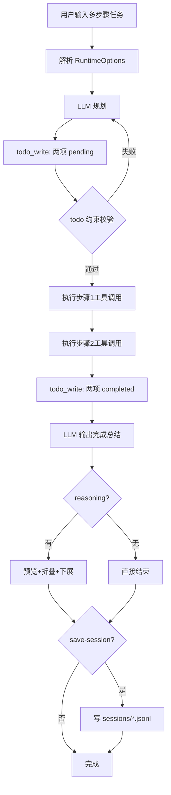

# v3: Todo 状态机执行（含通用运行时能力）

v3 的核心是 `todo_write` 强约束状态机。本次升级后，v3 也统一支持 thinking 开关、stream/non-stream、reasoning 折叠、会话保存。

## 模拟问题
先 `todo_write` 规划两步，再执行并把两步标记 `completed`。

## 决策步骤（编号）
1. 读取运行时配置并初始化 todo 提醒机制。
2. 第一轮调用 `todo_write` 写入两个 `pending` 任务。
3. 执行第一个任务（例如 `write_file`/`read_file`）。
4. 执行第二个任务。
5. 再次调用 `todo_write`，把两项状态更新为 `completed`。
6. 返回最终答复并给出完成度。
7. reasoning 有内容时按规则折叠并支持 `r` 下展。
8. 可选写入 session 文件并打印路径。

## Mermaid 全过程流程图


## 运行命令（nano-claude）
```bash
conda run -n nano-claude python v3_todo_agent_demo/todo_agent.py \
  "先用 todo_write 规划两步，然后执行并把两步标记 completed" \
  --thinking auto \
  --reasoning-effort low \
  --show-llm-response \
  --save-session
```

## 一次真实输出摘录（简短）
```text
Todo List Updated:
- [ ] Step 1: 创建示例文件
- [ ] Step 2: 验证文件内容

Todo List Updated:
- [✅] Step 1: 创建示例文件
- [✅] Step 2: 验证文件内容
(2/2 items completed)
```

[← v2](./v2_basic_agent_demo.md) | [返回 README](../README.md) | [v4 →](./v4_subagent.md)
