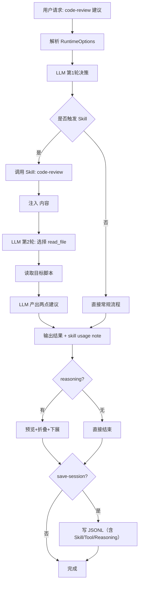

# v5: Skill 注入机制（含通用运行时能力）

v5 在 v4 架构上加入 `Skill` 工具。升级后保持 Skill 注入路径不变，只增强通用运行时展示与会话保存能力。

## 模拟问题
先加载 `code-review` Skill，再只读检查一个脚本并给两点建议。

## 决策步骤（编号）
1. 解析统一运行时配置并进入主循环。
2. 主代理识别“代码评审”意图，优先调用 `Skill(skill_name = "code-review")`。
3. Skill 内容以 tool_result 方式注入对话上下文。
4. 主代理使用只读工具（如 `read_file`）检查目标脚本。
5. 汇总并输出两条可执行建议。
6. 记录 Skill 使用标签与 actor 级 trace 日志。
7. 若有 reasoning，按 preview + fold + `r` 下展规则展示。
8. 可选保存完整会话（含 skill/tool/assistant/reasoning）。

## Mermaid 全过程流程图


## 运行命令（nano-claude）
```bash
conda run -n nano-claude python v5_skills_agent_demo/skills_agent.py \
  "先加载 code-review skill，然后只读检查 v2_basic_agent_demo/basic_agent.py 并给两条建议" \
  --thinking on \
  --reasoning-effort medium \
  --show-llm-response \
  --save-session
```

## 一次真实输出摘录（简短）
```text
Tool: Skill(skill_name="code-review")
Tool: read_file(file_path="v2_basic_agent_demo/basic_agent.py")
建议1：补充 tool 参数解析失败时的用户可见错误提示。
建议2：为 stream 模式补充逐块输出回归测试，避免终端重复打印。
<skill-usage>
used_skills: code-review
</skill-usage>
```

[← v4](./v4_subagent.md) | [返回 README](../README.md)
